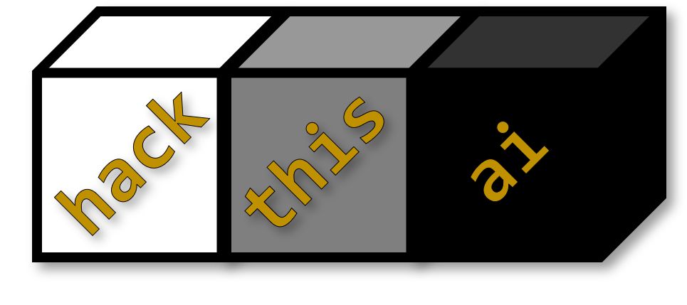

# HackThisAI

This is a seires of capture the flag (CTF) challenges to educate and train [adversarial machine learning](https://en.wikipedia.org/wiki/Adversarial_machine_learning) techniques. Ideally, this would be a fully online platform to maximize access and reduce technical barriers to entry.  

Currently, I've prototyped some small challenges to illustrate how the CTF would work. If you're interested in supporting the project or collaborating, please contact me.  

## Playing with the challenges

All of the challenges are self contained in the `challenge` directory. As provided, it would be easy to make any of these `white box` challenges by looking at the source. However, most were designed to be `black box` (no knowledge of the underlying source).  

Each challenge is contained in a docker container. You interact with the challenges through flask endpoints. I've tried to provide all of the necessary commands, but these prototypes may take some tinkering. If you hit any roadblocks, post an issue and I'll try and help.

The general flow is:
Requirement: Docker
1. Clone this directory.
2. Navigate to a challenge directory.
3. Run the commands in `README.md`.

If you are more comfortable in [Jupyter Notebooks](https://jupyter.org/), you should be able to run the challenges from `helper_notebook.ipynb`. This notebook will clone down the repository, build the containers, and run them. You can then interact with them from the notebook. In fact, `helper_notebook.ipynb` should allow you to complete `easy_credit_check`. Unfortunately, you still need to have jupyter notebooks and docker on your system.

[Get Jupyter](https://jupyter.org/install)  
[Get Docker](https://docs.docker.com/get-docker/)  
